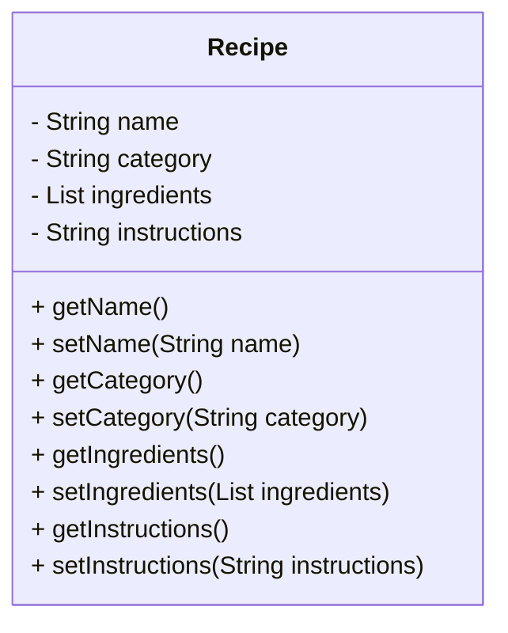

```mermaid
classDiagram
    class Recipe {
        - String name
        - String category
        - List<String> ingredients
        - String instructions

        + getName()
        + setName(String name)
        + getCategory()
        + setCategory(String category)
        + getIngredients()
        + setIngredients(List<String> ingredients)
        + getInstructions()
        + setInstructions(String instructions)
    }
```
